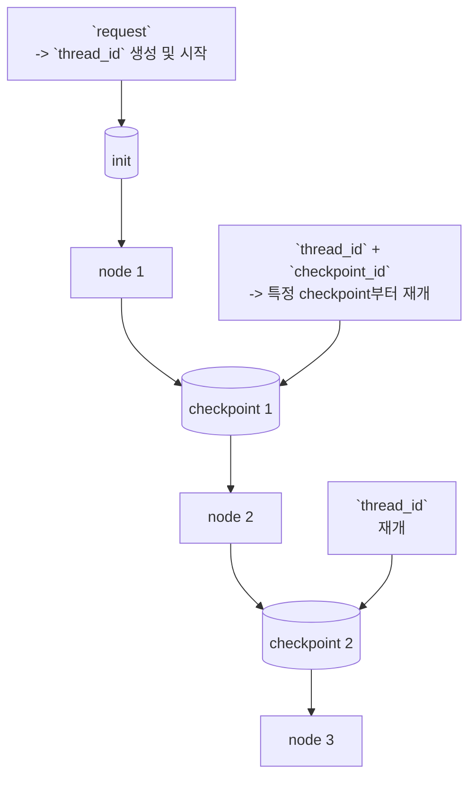

# Team Agents

Human-in-the-loop 대화형 멀티에이전트 작업 시스템

## 목적

소프트웨어 엔지니어의 관점에서 다양한 과제를 AI 주도로 해결하고 개선하기 위한 프로젝트입니다.

## 기능

- **멀티 에이전트 시스템** - 에이전트별 목적에 맞는 프롬프트, 툴, 템퍼러처 적용
  - `TaskAnalysis` (0.2) - 사용자 요청 분석 및 질문 생성
  - `Plan` (0.2) - 계획 수립
  - `Execution` (0.5) - 작업 실행 (웹 검색 등 툴 사용)
  - `Review` (0.3) - 실행 결과 검토 (반려 시 재계획)
  - `Report` (0.2) - 최종 리포트 작성
  - `ReportFeedbackAnalysis` (0.2) - 피드백 분석 (종료 또는 재계획)
- **휴먼 인 더 루프** - LangGraph interrupt 기반 질문/피드백 수집
  - `TaskQuestion` - 요청 명확화를 위한 사용자 질문
  - `ReportFeedback` - 리포트 승인/반려를 위한 사용자 피드백
- **퓨샷 프롬프팅** - 각 노드에 다수 예시 제공으로 응답 품질 개선
- **체크포인트 & 상태 관리** - PostgreSQL 기반 재개/타임트래블
- **웹 검색 툴 연동** - DuckDuckGo Search로 실시간 정보 검색

## 개발환경

**애플 실리콘 기반 macOS 이외의 플랫폼/아키텍처는 테스트되지 않았습니다.**

### AI Model: GLM-4.7

Z.ai의 [GLM Coding Plan](https://docs.z.ai/devpack/overview)을 사용합니다.
Claude API와 호환됩니다.

`.claude/settings.local.json` 파일에 API Key를 `env.ANTHROPIC_AUTH_TOKEN`에 넣어주세요.

_이 파일은 커밋되지 않습니다. `.gitignore` 내 `.claude/*.local.*` 패턴입니다._

```json
{
  "env": {
    "ANTHROPIC_AUTH_TOKEN": "your token",
    "ANTHROPIC_BASE_URL": "https://api.z.ai/api/anthropic",
    "API_TIMEOUT_MS": "3000000",
    "CLAUDE_CODE_DISABLE_NONESSENTIAL_TRAFFIC": "1"
  }
}
```

### Claude Code

공동 작업자입니다.
같이 의논하고 고민하고 해결하는데 사용합니다.

설치: [Claude Code Overview](https://code.claude.com/docs/en/overview)

설치 확인:

```bash
claude --version # 2.1.27 (Claude Code)
```

### uv

파이썬 기반 환경의 프로젝트를 관리 하기 위한 도구입니다.

설치: [Installing uv](https://docs.astral.sh/uv/getting-started/installation/)

설치 확인:

```bash
uv --version # uv 0.9.28 (0e1351e40 2026-01-29)
```

### Docker

상태를 Postgres에 저장하고 모니터링하기 위한 컨테이너 관리 도구입니다.

설치: [Install Docker Desktop on Mac](https://docs.docker.com/desktop/setup/install/mac-install/)

설치 확인:

```bash
docker --version # Docker version 28.3.2, build 578ccf6
```

실행:

```bash
docker compose up -d
```

## 시스템 구조

### 시작 및 재개

프롬프트 또는 툴의 수정 후의 동작을 확인하기 위해서 재개 기능을 최우선으로 구현합니다.


